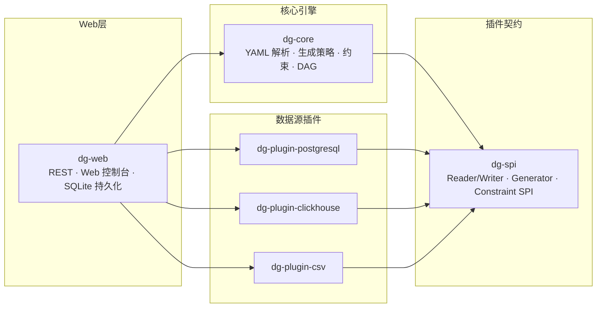
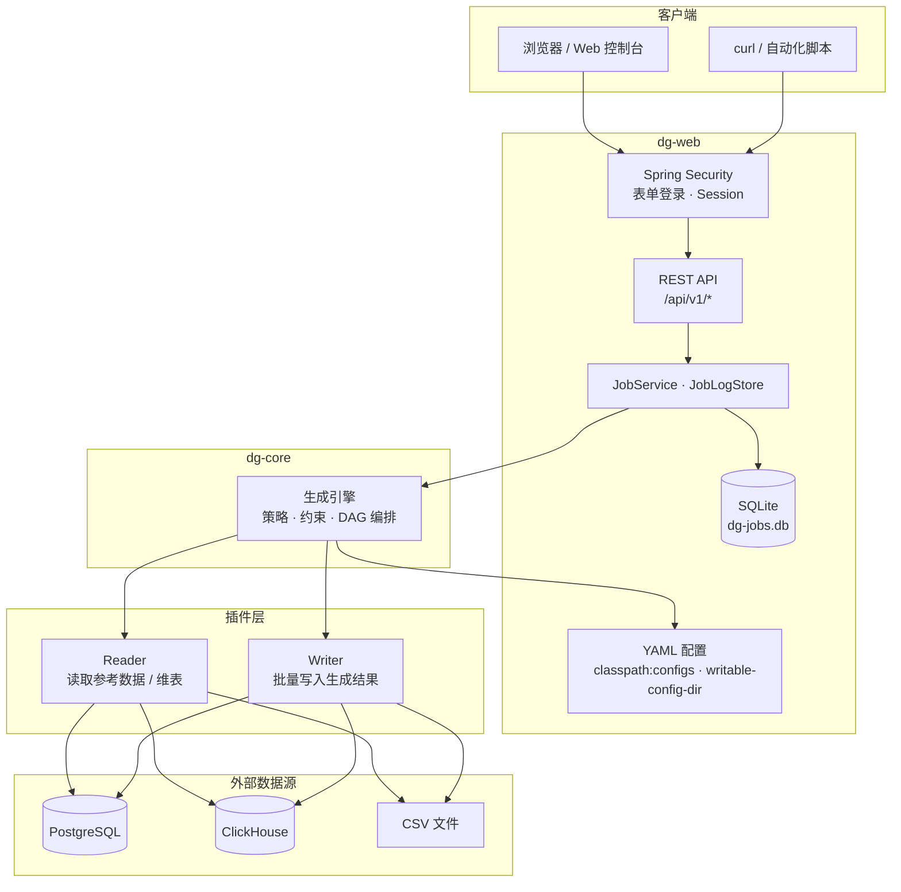

# Data Generator

基于 YAML 配置的测试数据自动生成 REST 服务。通过 Schema、生成策略与约束规则定义业务数据，支持 PostgreSQL、ClickHouse、CSV 等异构数据源读写，适用于自动化测试造数与开发/联调环境填充。

**技术栈：** Java 21 · Spring Boot 3.3 · Maven 多模块 · SQLite（任务持久化）· Spring Security（表单登录）

## 模块结构

```
data-generator/          # 父 POM
├── dg-spi/              # 插件契约（Reader/Writer、Generator、Constraint 接口与公共模型）
├── dg-core/             # 核心引擎（YAML 解析、生成策略、约束引擎、DAG 编排）
├── dg-plugins/          # 插件聚合（各数据源独立子模块）
│   ├── dg-plugin-postgresql/
│   ├── dg-plugin-clickhouse/
│   └── dg-plugin-csv/
└── dg-web/              # Web 应用（REST API + Web 控制台 + 配置装配）
```

依赖关系：`dg-web → dg-core → dg-spi`；各 `dg-plugin-* → dg-spi`（按需引入）。

## 架构图

### 模块依赖



### 运行时架构

一次 Job 从提交到落库的完整路径：



**要点：**

- **dg-web** 负责 HTTP 适配、认证、任务调度与 SQLite 持久化；不直接操作数据源
- **dg-core** 纯业务引擎，按 YAML 定义驱动生成流水线，通过 SPI 调用插件
- **插件** 各自独立 AutoConfiguration 注册，按需引入 classpath；Reader 读参考数据，Writer 写生成结果
- 小任务同步返回，超过 `sync-threshold` 行数转异步，状态与日志写入 SQLite

## 快速开始

### 前置条件

- JDK 21+
- Maven 3.8+

### 构建与运行

```bash
# 打包可执行 fat jar
mvn -pl dg-web package -DskipTests

# 启动（默认从 classpath 读取 configs/，无需指定工作目录）
java -jar dg-web/target/dg-web-0.1.0-SNAPSHOT.jar
```

服务默认监听 `http://localhost:8080`。可通过环境变量或 `application.yml` 覆盖 `data-generator.*` 配置。

### Web 控制台

启动后访问 `http://localhost:8080`，会跳转到登录页。默认账号见 `application.yml` 中 `data-generator.auth`（生产环境请务必修改密码）。

控制台提供：

- **任务管理** — Job 定义 CRUD、提交运行、查看运行记录与日志
- **配置指南** — 内置 YAML 配置说明文档

### 运行测试

```bash
mvn clean test
```

> **PostgreSQL / ClickHouse 集成测试** 使用 Testcontainers，需要本地 **Docker** 可用。未安装 Docker 时，对应集成测试会被跳过（`@Disabled("Requires Docker")`），不影响其余单元测试通过。

## 配置目录

YAML 业务配置位于 `dg-web/src/main/resources/configs/`（打包后随 jar 内置，默认 `data-generator.config-dir: classpath:configs`）。如需外部目录覆盖，可设为绝对路径，例如 `/data/configs`：

```
dg-web/src/main/resources/
├── application.yml    # 应用级配置（端口、连接、认证、任务参数）
└── configs/
    ├── schemas/           # 表/数据集 Schema 定义
    ├── references/        # 参考数据（维表）读取配置
    ├── constraints/       # 可复用约束规则集
    └── jobs/              # 多表编排任务（DAG）
```

### application.yml 主要配置项

```yaml
data-generator:
  config-dir: classpath:configs
  writable-config-dir: ./data/configs   # Web 控制台新建/编辑 Job 的写入目录
  auth:
    enabled: true                       # false 时关闭登录（仅建议本地调试）
    username: admin
    password: admin123                  # 生产环境务必修改
  storage:
    sqlite-path: ./data/dg-jobs.db      # 任务记录与运行日志 SQLite 库
  connections:                          # 数据源连接（Schema/Job YAML 引用 connection 名）
    dev-pg:
      type: postgresql
      url: jdbc:postgresql://localhost:5432/dev
  job:
    sync-threshold: 5000                # 超过此行数转异步
    batch-size: 1000
    thread-pool-size: 4
```

Schema/Job YAML 通过 `connection: dev-pg` 等形式引用连接，避免在业务配置中硬编码凭证。

### 运行时数据

| 路径 | 说明 |
|------|------|
| `./data/dg-jobs.db` | 任务记录与运行日志（SQLite，重启后保留） |
| `./data/configs/` | Web 控制台写入的可编辑 Job 定义 |

## 认证说明

默认启用表单登录（Session）。未登录访问页面会跳转到 `/login.html`；API 未认证返回 401。

- **浏览器**：登录后 Session 自动携带，控制台与 API 均可正常使用
- **curl / 脚本**：需先登录获取 Session Cookie，或使用 `-b cookies.txt -c cookies.txt` 维持会话

```bash
# 登录（保存 Cookie）
curl -c cookies.txt -X POST http://localhost:8080/api/v1/auth/login \
  -d "username=admin&password=admin123"

# 后续请求携带 Cookie
curl -b cookies.txt http://localhost:8080/api/v1/jobs
```

`/api/v1/health` 无需认证，可用于健康探针。

## REST API 示例

所有接口前缀为 `/api/v1`（除 `/api/v1/health` 外均需登录）。

### 健康检查

```bash
curl http://localhost:8080/api/v1/health
```

```json
{ "status": "UP" }
```

### 列出 Schema

```bash
curl -b cookies.txt http://localhost:8080/api/v1/schemas
```

### 预览生成（不写库）

```bash
curl -b cookies.txt -X POST http://localhost:8080/api/v1/preview \
  -H "Content-Type: application/json" \
  -d '{
    "jobConfig": "jobs/single_customer.yaml",
    "overrides": { "tables.customers.count": 5 },
    "preview": { "limit": 5 }
  }'
```

响应包含 `status`、`progress` 及 `rows`（各表样本数据），不会写入任何数据源。

### Job 定义管理

```bash
# 列出所有 Job 定义
curl -b cookies.txt http://localhost:8080/api/v1/job-definitions

# 查看单个定义
curl -b cookies.txt http://localhost:8080/api/v1/job-definitions/my_job

# 创建 / 更新 / 删除
curl -b cookies.txt -X POST http://localhost:8080/api/v1/job-definitions \
  -H "Content-Type: application/json" \
  -d '{"name":"my_job","content":"job: my_job\n..."}'

curl -b cookies.txt -X PUT http://localhost:8080/api/v1/job-definitions/my_job \
  -H "Content-Type: application/json" \
  -d '{"content":"..."}'

curl -b cookies.txt -X DELETE http://localhost:8080/api/v1/job-definitions/my_job
```

### 提交生成任务

```bash
curl -b cookies.txt -X POST http://localhost:8080/api/v1/jobs \
  -H "Content-Type: application/json" \
  -d '{
    "jobConfig": "jobs/single_customer.yaml",
    "overrides": { "tables.customers.count": 100 },
    "writer": {
      "type": "csv",
      "connection": "local-csv",
      "mode": "insert"
    }
  }'
```

写入 PostgreSQL 时将 `writer.type` 改为 `postgresql`，`connection` 指向 `application.yml` 中已配置的连接名。

### 查询任务与日志

```bash
# 列出历史任务
curl -b cookies.txt http://localhost:8080/api/v1/jobs

# 查询单个任务
curl -b cookies.txt http://localhost:8080/api/v1/jobs/{jobId}

# 查询运行日志
curl -b cookies.txt http://localhost:8080/api/v1/jobs/{jobId}/logs

# 取消运行中任务 / 删除历史记录
curl -b cookies.txt -X DELETE http://localhost:8080/api/v1/jobs/{jobId}
curl -b cookies.txt -X DELETE http://localhost:8080/api/v1/jobs/{jobId}/record
```

## 能力概览

### P1（已完成）

| 能力 | 说明 |
|------|------|
| 四模块骨架 | `dg-spi` / `dg-core` / `dg-plugins` / `dg-web` |
| 数据源插件 | PostgreSQL、ClickHouse、CSV 读写 |
| 生成策略 | sequence、random、enum、regex、reference（维表引用） |
| 约束引擎 | 字段级（range、nullable、foreign_key）；组合级 SpEL（conditional、mutex） |
| 多表编排 | 单表快捷 Job + 多表 DAG（`depends_on` 拓扑排序） |
| REST API | health、schemas、preview、jobs |

### P2（当前）

| 能力 | 说明 |
|------|------|
| 采样分布 | reference 策略支持 `uniform` / `histogram` / `normal` 分布 |
| 异步任务 | 预估行数 > `syncThreshold` 时返回 **202 Accepted**，轮询 `GET /jobs/{id}` |
| Aviator 表达式 | `level: custom` 或 `language: aviator` 约束 |
| 空间约束 | JTS `within` 拓扑校验（点位于参考几何体内） |

### P3（当前）

| 能力 | 说明 |
|------|------|
| 种子模板 | Schema `seed.template` 内联模板 + `mutate` 字段变异 |
| Groovy 表达式 | `language: groovy` 约束与自定义表达式 |
| 约束 repair/warn | `on_fail: repair` 自动修正；`warn` 记录告警并继续 |
| 任务取消 | `DELETE /api/v1/jobs/{id}` 取消 PENDING/RUNNING 异步任务 |

### Web 与运维（当前）

| 能力 | 说明 |
|------|------|
| Web 控制台 | 任务管理、Job 定义编辑、运行记录与日志查看、配置指南 |
| 表单登录 | Spring Security Session 认证，`data-generator.auth.*` 可配置 |
| 任务持久化 | SQLite 存储任务记录与全量运行日志，重启后可查历史 |
| Job 定义 CRUD | REST + Web UI，可写配置存于 `writable-config-dir` |

## 许可证

内部项目，版本 `0.1.0-SNAPSHOT`。
