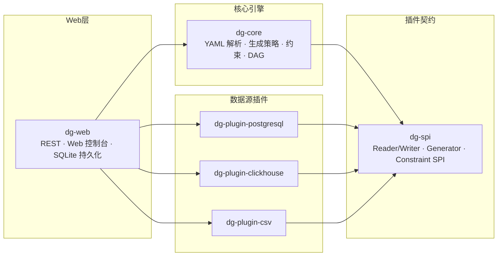
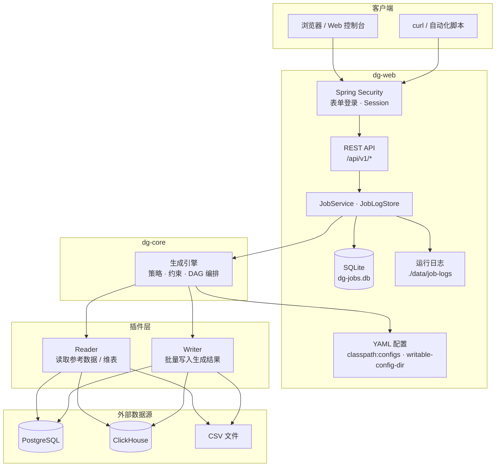

# Data Generator

基于 YAML 配置的测试数据自动生成 REST 服务。通过 Schema、生成策略与约束规则定义业务数据，支持 PostgreSQL、ClickHouse、CSV 等异构数据源读写，适用于自动化测试造数与开发/联调环境填充。

**技术栈：** Java 21 · Spring Boot 3.3 · Maven 多模块 · SQLite（任务持久化）· Spring Security（表单登录）

## 模块结构

```
data-generator/          # 父 POM
├── dg-spi/              # 插件契约（Reader/Writer、Generator、Constraint 接口与公共模型）
├── dg-core/             # 核心引擎（YAML 解析、生成策略、约束引擎、DAG 编排）
├── dg-plugins/          # 插件聚合（各数据源独立子模块）
│   ├── dg-plugin-postgresql/
│   ├── dg-plugin-clickhouse/
│   └── dg-plugin-csv/
└── dg-web/              # Web 应用（REST API + Web 控制台 + 配置装配）
```

依赖关系：`dg-web → dg-core → dg-spi`；各 `dg-plugin-* → dg-spi`（按需引入）。

## 架构图

### 模块依赖



### 运行时架构

一次 Job 从提交到落库的完整路径：



**要点：**

- **dg-web** 负责 HTTP 适配、认证、任务调度与持久化；不直接操作数据源
- **dg-core** 纯业务引擎，按 YAML 定义驱动生成流水线，通过 SPI 调用插件
- **插件** 各自独立 AutoConfiguration 注册，按需引入 classpath；Reader 读参考数据，Writer 写生成结果；支持 Job 级 **`writers` 多写**（同一批数据同时写入 PG / ClickHouse / CSV 等多个目标）
- 小任务同步返回，超过 `sync-threshold` 行数转异步；任务元数据存 SQLite，运行日志按任务写入 `log-dir` 文件，批次 flush 后更新进度（节流持久化，表完成时强制落盘）
- 单表行数 ≥ 5000 时，引擎按 `thread-pool-size` **并行生成**行数据；多表 DAG 上游表在内存中仅保留下游 `reference` / `foreign_key` 所需列

## 快速开始

### 前置条件

- JDK 21+
- Maven 3.8+

### 构建与运行

```bash
# 打包可执行 fat jar
mvn -pl dg-web package -DskipTests

# 启动（默认从 classpath 读取 configs/，无需指定工作目录）
java -jar dg-web/target/dg-web-0.1.0-SNAPSHOT.jar
```

服务默认监听 `http://localhost:8080`。可通过环境变量、`application.yml` 或 `application-local.yml` 覆盖 `data-generator.*` 配置（本地敏感项推荐后者，见 `application-local.yml.example`）。

### Web 控制台

启动后访问 `http://localhost:8080`，会跳转到登录页。默认账号见 `application.yml` 中 `data-generator.auth`。

> **安全提示：** 默认凭据（`admin` / `admin123`）仅供本地试用。生产或公网部署前必须修改用户名与密码；数据库连接密码请写入 `application-local.yml`（参考 `application-local.yml.example`），勿提交到版本库。

控制台提供：

- **任务管理** — Job 定义 CRUD、Cron 定时调度、提交运行、运行记录与日志（分页）；**自动刷新**（默认开启，运行中/日志弹窗 2 秒、空闲 5 秒，增量更新状态避免整表闪烁）
- **配置指南** — 内置 YAML 配置说明文档

### 运行测试

```bash
mvn clean test
```

> **PostgreSQL / ClickHouse 集成测试** 使用 Testcontainers，需要本地 **Docker** 可用。未安装 Docker 时，对应集成测试会被跳过（`@Disabled("Requires Docker")`），不影响其余单元测试通过。

## 配置目录

YAML 业务配置默认从 `data-generator.config-dir` 加载（默认 `classpath:configs`）。可将 `config-dir` 设为外部绝对路径（如 `/data/configs`），或在 `writable-config-dir` 中通过控制台维护自定义 Job：

```
configs/                    # 或你指定的 config-dir 根目录
├── schemas/                # 可复用的表/数据集 Schema
├── references/             # 参考数据（维表）读取配置
├── constraints/            # 可复用约束规则集
└── jobs/                   # 自行编写的多表编排 Job（YAML）
```

控制台新建的自定义 Job 写入 `writable-config-dir`（默认 `./data/configs/jobs/`），与 `config-dir` 下的定义合并展示。

### application.yml 主要配置项

```yaml
data-generator:
  config-dir: classpath:configs
  writable-config-dir: ./data/configs   # Web 控制台新建/编辑 Job 的写入目录
  auth:
    enabled: true                       # false 时关闭登录（仅建议本地调试）
    username: admin
    password: admin123                  # 生产环境务必修改；可覆盖于 application-local.yml
  storage:
    sqlite-path: ./data/dg-jobs.db      # 任务记录 SQLite 库
    log-dir: ./data/job-logs          # 运行日志文件目录（每任务一个文件）
  connections:                          # 数据源连接（Schema/Job YAML 引用 connection 名）
    dev-pg:
      type: postgresql
      url: jdbc:postgresql://localhost:5432/dev
      username: postgres
      password: changeme                # 真实密码写入 application-local.yml
  job:
    sync-threshold: 5000                # 超过此行数转异步
    batch-size: 1000                    # 写入批次；进度/日志按批更新（持久化有节流）
    thread-pool-size: 4                 # 异步任务线程池；单表 ≥5000 行时并行生成行数据
```

Schema/Job YAML 通过 `connection: dev-pg` 等形式引用连接，避免在业务配置中硬编码凭证。

### 运行时数据

| 路径 | 说明 |
|------|------|
| `./data/dg-jobs.db` | 任务记录（SQLite，重启后保留） |
| `./data/job-logs/` | 运行日志文件（每任务 `{jobId}.log`） |
| `./data/configs/` | Web 控制台写入的可编辑 Job 定义 |

## 认证说明

默认启用表单登录（Session）。未登录访问页面会跳转到 `/login.html`；API 未认证返回 401。

- **浏览器**：登录后 Session 自动携带，控制台与 API 均可正常使用
- **curl / 脚本**：需先登录获取 Session Cookie，或使用 `-b cookies.txt -c cookies.txt` 维持会话

```bash
# 登录（保存 Cookie）
curl -c cookies.txt -X POST http://localhost:8080/api/v1/auth/login \
  -d "username=admin&password=admin123"

# 后续请求携带 Cookie
curl -b cookies.txt http://localhost:8080/api/v1/jobs
```

`/api/v1/health` 无需认证，可用于健康探针。

## REST API 示例

所有接口前缀为 `/api/v1`（除 `/api/v1/health` 外均需登录）。

### 健康检查

```bash
curl http://localhost:8080/api/v1/health
```

```json
{ "status": "UP" }
```

### 列出 Schema

```bash
curl -b cookies.txt http://localhost:8080/api/v1/schemas
```

### 预览生成（不写库）

```bash
curl -b cookies.txt -X POST http://localhost:8080/api/v1/preview \
  -H "Content-Type: application/json" \
  -d '{
    "jobConfig": "jobs/my_job.yaml",
    "overrides": { "tables.customers.count": 5 },
    "preview": { "limit": 5 }
  }'
```

响应包含 `status`、`duration` 及 `tables`（各表 `tableName`、`columns`、`rows` 样本数据），不会写入任何数据源。

### Job 定义管理

```bash
# 列出所有 Job 定义（响应含 fileName、name、id、schedule、createdAt 等）
curl -b cookies.txt http://localhost:8080/api/v1/job-definitions
# fileName 为配置文件名（API 路径参数）；name 为任务显示名称

# 查看单个定义（自定义任务返回的 content 不含顶层 name，由 displayName 维护）
curl -b cookies.txt http://localhost:8080/api/v1/job-definitions/joba1b2c3d4

# 创建自定义任务（displayName 必填；id/name 写入 YAML；文件名默认用生成的 id）
curl -b cookies.txt -X POST http://localhost:8080/api/v1/job-definitions \
  -H "Content-Type: application/json" \
  -d '{
    "displayName": "我的测试任务",
    "content": "writer:\n  type: csv\n  connection: local-csv\n  mode: insert\ntables: []",
    "schedule": { "enabled": true, "cron": "0 0 2 * * ?" }
  }'

# 更新（fileName 为路径参数；displayName 更新 YAML name）
curl -b cookies.txt -X PUT http://localhost:8080/api/v1/job-definitions/joba1b2c3d4 \
  -H "Content-Type: application/json" \
  -d '{"displayName":"更新后的名称","content":"..."}'

curl -b cookies.txt -X DELETE http://localhost:8080/api/v1/job-definitions/joba1b2c3d4

# 调度（自定义任务也可单独 PUT；内置任务只读）
curl -b cookies.txt http://localhost:8080/api/v1/job-definitions/my_builtin/schedule
```

自定义任务 YAML **禁止**包含 `schedule` 块；`id` 新建时自动生成；可选 `name` 指定 ASCII 配置文件名，否则与 `id` 相同。

### 提交生成任务

单写示例：

```bash
curl -b cookies.txt -X POST http://localhost:8080/api/v1/jobs \
  -H "Content-Type: application/json" \
  -d '{
    "jobConfig": "jobs/my_job.yaml",
    "overrides": { "tables.customers.count": 100 },
    "writer": {
      "type": "csv",
      "connection": "local-csv",
      "mode": "insert"
    }
  }'
```

多写（同一批数据同时写入 PG 与 ClickHouse；Job YAML 中已配置 `writers` 时以 YAML 为准）：

```bash
curl -b cookies.txt -X POST http://localhost:8080/api/v1/jobs \
  -H "Content-Type: application/json" \
  -d '{
    "jobConfig": "jobs/my_job.yaml",
    "writers": [
      { "type": "postgresql", "connection": "dev-pg", "mode": "insert" },
      { "type": "clickhouse", "connection": "dev-ck", "mode": "insert" }
    ]
  }'
```

写入 PostgreSQL 时将 `type` 改为 `postgresql`，`connection` 指向 `application.yml` 中已配置的连接名。单写/多写 YAML 与优先级说明见 Web 控制台「配置指南 → 指定写入目标」。

### 查询任务与日志

```bash
# 列出历史任务（分页，默认 page=1 size=50）
curl -b cookies.txt http://localhost:8080/api/v1/jobs?page=1&size=50
# 响应: {"items":[...],"total":100,"page":1,"size":50}

# 查询单个任务
curl -b cookies.txt http://localhost:8080/api/v1/jobs/{jobId}

# 查询运行日志
curl -b cookies.txt http://localhost:8080/api/v1/jobs/{jobId}/logs

# 取消运行中任务 / 删除历史记录
curl -b cookies.txt -X DELETE http://localhost:8080/api/v1/jobs/{jobId}
curl -b cookies.txt -X DELETE http://localhost:8080/api/v1/jobs/{jobId}/record
```

## 能力概览

### P1（已完成）

| 能力 | 说明 |
|------|------|
| 四模块骨架 | `dg-spi` / `dg-core` / `dg-plugins` / `dg-web` |
| 数据源插件 | PostgreSQL、ClickHouse、CSV 读写 |
| 生成策略 | sequence、random、enum、regex、reference、seed、expression（SpEL/Aviator/Groovy）；**uuid、phone、email、literal、idcard**（含 `from`/`part` 派生与复制）；字段级 **primaryKey** 标识；全策略通用 **default / prefix / width**（`default` 用于 null/空串兜底；`prefix` 要求字符串 type） |
| 约束引擎 | 字段级（range、nullable、foreign_key）；组合级 SpEL（conditional、mutex） |
| 多表编排 | 单表快捷 Job + 多表 DAG（`depends_on` 拓扑排序） |
| 写入目标 | 单写 `writer`；多写 `writers`（同一批数据 fan-out 至 PG / ClickHouse / CSV 等） |
| REST API | health、schemas、preview、jobs |

### P2（当前）

| 能力 | 说明 |
|------|------|
| 采样分布 | reference 策略支持 `uniform` / `histogram` / `normal` 分布 |
| 异步任务 | 预估行数 > `syncThreshold` 时返回 **202 Accepted**，轮询 `GET /jobs/{id}` |
| Aviator 表达式 | `level: custom` 或 `language: aviator` 约束 |
| 空间约束 | JTS `within` 拓扑校验（点位于参考几何体内） |

### P3（当前）

| 能力 | 说明 |
|------|------|
| Job 级 seeds | 顶层 `seeds[]` 多命名数据源；字段 `strategy: seed` + `source`；支持 `link` 关联采样；**单个 seed 查询无结果时不阻断任务**，对应字段为 null（可配 `default` 兜底） |
| Groovy 表达式 | `language: groovy` 约束与自定义表达式 |
| 约束 repair/warn | `on_fail: repair` 自动修正；`warn` 记录告警并继续 |
| 任务取消 | `DELETE /api/v1/jobs/{id}` 取消 PENDING/RUNNING 任务（同步/异步） |
| 大任务性能 | 单表 ≥5000 行并行生成；FK 校验 Hash 索引；upstream 行瘦身；seed 预加载与 L2 行级快照跨表复用 |

### Web 与运维（当前）

| 能力 | 说明 |
|------|------|
| Web 控制台 | 任务管理、Job 定义编辑、Cron 调度、运行记录与日志（分页）、配置指南；自动刷新与增量 DOM 更新 |
| 表单登录 | Spring Security Session 认证，`data-generator.auth.*` 可配置 |
| 任务持久化 | SQLite 存储任务记录；运行日志写入 `log-dir` 文件，重启后可查历史 |
| Job 定义 CRUD | REST + Web UI；自定义 YAML 存 `writable-config-dir`，调度存 SQLite |
| Job 定时调度 | Cron 触发、同配置 FIFO 排队、手动运行与调度并存 |

## 许可证

内部项目，版本 `0.1.0-SNAPSHOT`。
