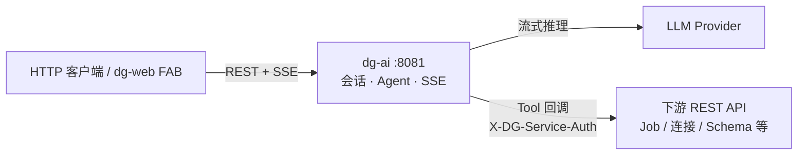
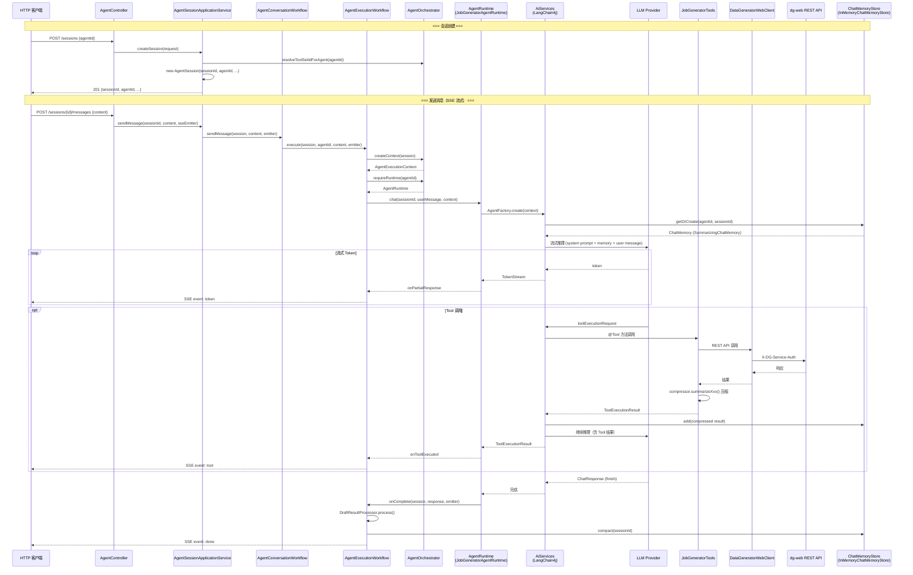

# dg-ai — AI Agent HTTP 服务

基于 Spring Boot 3.3 与 LangChain4j 的**独立 HTTP 服务**：提供多轮对话、SSE 流式响应、Agent / Tool Set 编排，以及通过 Tool 回调外部 REST API 完成 Job YAML 生成与校验。

| 项 | 说明 |
|---|---|
| 框架 | Spring Boot 3.3、LangChain4j 1.8 |
| 默认端口 | `8081` |
| API 基路径 | `/api/v1/agent` |
| 首版 Agent | `job-generator` — Tool Set `job-generator-tools` |
| 通信方式 | REST + SSE（`text/event-stream`） |

---

## 概念模型

两层能力边界，**创建会话时由配置绑定，会话内固定**；运行时具体调用哪个 Tool 由 **LLM + Agent 系统提示** 决定。

```
Agent（job-generator）          ← AgentRuntime + prompt/templates/{agentId}/（工作流程 / 系统提示）
Tool Set（job-generator-tools） ← JobGeneratorTools，多 Agent 可共用
```

| 层 | 配置 / 资源 | 职责 |
|----|-------------|------|
| **Agent** | `ai.agents.<agentId>.tool-set-id`；`prompt/templates/{agentId}/` | 编排入口：系统提示、工作流程、选模型、挂 Memory、装配 Tool |
| **Tool Set** | `ToolProvider.toolSetId()` | 声明可用 Tool 集合 |

扩展新 Agent：
1. 实现 `AgentRuntime` 并注册 Bean
2. 实现 `ChatMemoryContentCompressor` 提供 Agent 专属记忆压缩策略（可选）
3. 添加 `prompt/templates/<agentId>/` 系统提示
4. 在 `ai.agents` 下配置 `tool-set-id` 及可选记忆参数

> Cursor 侧开发文档仍可使用 `.cursor/skills/generate-job/`；运行时 Prompt 以 `prompt/templates/{agentId}/` 为准。

---

## 架构

### 顶层组件



### 代码调用链路



**调用链要点：**

| 阶段 | 关键组件 | 说明 |
|------|---------|------|
| 会话 | `AgentSession` + `ChatMemoryStore` | 按 `sessionId` 隔离，同一用户多轮共享记忆 |
| 路由 | `AgentOrchestrator` → `AgentRuntime` | 按 `agentId` 分发到对应 Runtime |
| 推理 | `AiServices` → LLM | LangChain4j 托管流式对话 + Tool 调用循环 |
| 记忆 | `SummarizingChatMemory` → `ChatMemoryContentCompressor` | 写入前压缩大段 YAML，压缩策略按 agentId 选择 |
| Tool | `JobGeneratorTools` → `DataGeneratorWebClient` | 回调 dg-web，结果经压缩后写入记忆 |
| 响应 | SSE `token` / `tool` / `done` | 流式推送到客户端 |

**多轮对话：** 同一 `sessionId` 下 LangChain4j `ChatMemory` 累积历史；`AgentSession` 保留 `draftYaml` 等状态。会话 TTL 内有效；无消息历史 REST 接口。

---

## 快速开始

### 构建

```bash
mvn clean package -pl dg-ai -am -DskipTests
```

### 配置

```yaml
ai:
  enabled: true
  server: true
  default-provider: deepseek
  agents:
    job-generator:
      tool-set-id: job-generator-tools
  remote-services:
    data-generator-web:
      base-url: http://localhost:8080
      service-auth-token: your-token
  providers:
    deepseek:
      type: open-ai-compatible
      base-url: https://api.deepseek.com/v1
      api-key: ${DEEPSEEK_API_KEY:}
      model: deepseek-chat
```

创建会话须传 **`agentId`**（如 `job-generator`）。

### 启动

```bash
java -jar target/dg-ai-0.1.0-SNAPSHOT.jar
```

健康检查：`GET /api/v1/agent/agents`（需 `ai.server=true`）。

---

## REST API

| 方法 | 路径 | 说明 |
|------|------|------|
| `GET` | `/agents` | 已注册 Agent 及 `toolSetId` |
| `GET` | `/providers` | 已配置 LLM Provider |
| `POST` | `/sessions` | 创建会话 `{ "agentId", "provider"? }` — **`agentId` 必填** |
| `GET` | `/sessions/{sessionId}` | 会话快照（默认不含 `draftYaml`，含 `hasDraft`） |
| `GET` | `/sessions/{sessionId}?includeDraft=true` | 会话快照（含完整草稿 YAML） |
| `GET` | `/sessions/{sessionId}/draft` | 仅返回 `{ "draftYaml": "..." }` |
| `DELETE` | `/sessions/{sessionId}` | 删除会话与对话记忆 |
| `POST` | `/sessions/{sessionId}/messages` | 发送消息，响应 **SSE**（同会话并发返回 **409**） |

### 创建会话示例

```json
POST /api/v1/agent/sessions
{ "agentId": "job-generator", "provider": "deepseek" }

→ 201
{
  "sessionId": "uuid",
  "agentId": "job-generator",
  "provider": "deepseek",
  "createdAt": "...",
  "draftYaml": null,
  "hasDraft": false,
  "draftIncomplete": false,
  "draftValidated": false
}
```

校验通过的草稿：`done` 事件 `draftValidated=true` 时，前端可 `GET /sessions/{id}/draft` 拉取 YAML 并打开 Job 编辑窗口。

---

## Agent 系统提示

| 资源 | 用途 |
|------|------|
| `prompt/templates/{agentId}/` | 系统提示与工作流程（`system.md`、`reference.md`、`overlay.md`、`output-format.md`） |
| `prompt/templates/{agentId}/continue-*.md` | 自动续写 / 修复轮用户消息模板 |

修改 Agent 行为 → 编辑 `prompt/templates/{agentId}/`。

---

## job-generator 交付模型

| 阶段 | 行为 |
|------|------|
| 生成 | 模型输出 ```json { message, draftYaml, draftComplete } ``` |
| 合并 | 写入 `session.draftYaml`；未完成时 APPEND / REPAIR 自动续写 |
| 校验 | Tool 调用下游 YAML 校验；失败推送 `validation_error` |
| 保存 | 用户明确要求时调用 `saveDraftJobDefinition`；成功推送 `job_saved` |

---

## SSE 事件

| 事件 | 说明 |
|------|------|
| `token` | 流式文本 |
| `tool` | Tool 调用完成 |
| `job_saved` | 草稿已持久化 |
| `validation_error` | YAML 校验失败 |
| `error` | 流式错误 |
| `done` | 本轮结束 |

---

## 模块结构

```
src/main/java/com/datagenerator/ai/
├── web/              AgentController、DTO、SSE
├── application/      会话服务、workflow
├── agent/            AgentRuntime、Orchestrator、JobGeneratorMemoryCompressor、DraftResult*
├── memory/           ChatMemoryStore、ChatMemoryContentCompressor（接口）、SummarizingChatMemory
├── tool/             Tool Set、JobGeneratorTools
├── prompt/           PromptTemplateLoader
└── config/           AiProperties、AiAutoConfiguration（含 RestTemplate/DataGeneratorWebClient）
```

---

## 配置参考

| 配置键 | 说明 |
|--------|------|
| `ai.agents.<id>.tool-set-id` | Agent 绑定的 Tool Set（必填） |
| `ai.agents.<id>.chat-memory-max-tokens` | 覆盖全局 `ai.chat-memory-max-tokens`（可选） |
| `ai.agents.<id>.chat-memory-max-messages` | 覆盖全局 `ai.chat-memory-max-messages`（可选） |
| `ai.agents.<id>.chat-memory-tool-result-max-chars` | 覆盖全局 `ai.chat-memory-tool-result-max-chars`（可选） |
| `ai.default-provider` | 默认 LLM |
| `ai.session.ttl` | 会话空闲过期（默认 `2h`） |
| `ai.remote-services.data-generator-web.*` | Tool 回调 dg-web |

---

## 开发与测试

```bash
mvn test -pl dg-ai
```
