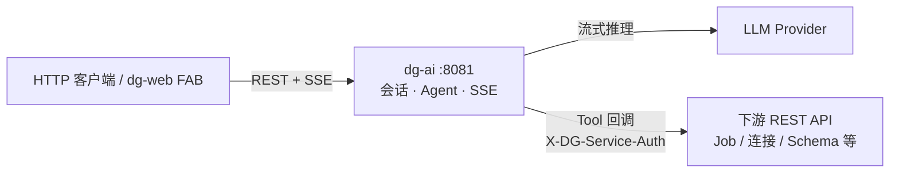
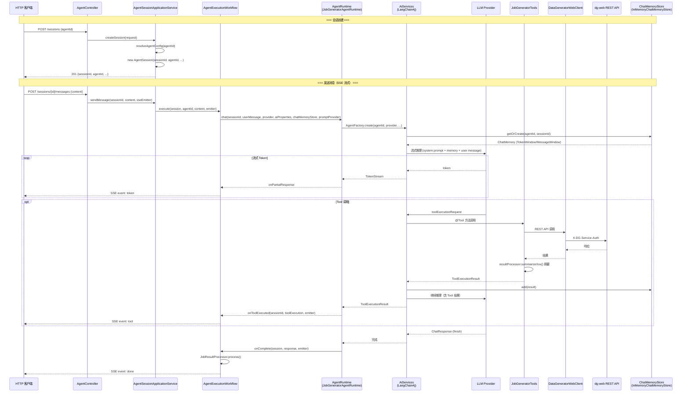

# dg-ai — AI Agent HTTP 服务

基于 Spring Boot 3.3 与 LangChain4j 的**独立 HTTP 服务**：提供多轮对话、SSE 流式响应、Agent 运行时编排，以及通过 Tool 回调外部 REST API 完成 Job YAML 生成、校验与管理。

| 项 | 说明 |
|---|---|
| 框架 | Spring Boot 3.3、LangChain4j 1.8 |
| 默认端口 | `8081` |
| API 基路径 | `/api/v1/agent` |
| 首版 Agent | `job-generator` |
| 通信方式 | REST + SSE（`text/event-stream`） |
| 源文件数 | 33 个 Java 源文件，20 个子包 |

---

## 概念模型

**Agent = `AgentRuntime` 接口 + `AgentPrompt` 系统提示 + @Tool 方法。**

无独立的 Tool Set / Tool Provider / Tool Registry 层。Tool 的创建与绑定由 `AgentRuntime` 实现自管理。Agent 与 Tool 的映射在运行时由 `createToolExecutors()` 方法决定。

```
Agent（job-generator）← AgentRuntime + AgentPrompt(prompt/templates/{agentId}/*.md) + JobGeneratorTools
```

| 层 | 配置 / 资源 | 职责 |
|----|-------------|------|
| **Agent** | `ai.agents.<agentId>.provider`；`prompt/templates/{agentId}/` | 编排入口：系统提示、工作流程、选模型、挂 Memory、创建 Tool |

扩展新 Agent：
1. 实现 `AgentRuntime` 接口（6 个方法）并加 `@Component` 注解
2. 在 `ai.agents` 下配置 `provider`
3. 添加 `prompt/templates/<agentId>/` 目录，放入任意 `.md` 文件（自动扫描加载）

---

## 架构

### 顶层组件



### 核心接口

整个 dg-ai 模块仅包含 **1 个接口**：

- **`AgentRuntime`** — 6 个方法：`agentId()`、`createToolExecutors()`、`chat()`、`onToolExecuted()`、`onComplete()`、`evictSession()`

无 `StreamingHandleRegistry`、`SseEventFactory`、`ToolProvider`、`ToolRegistry`、`ToolExecutorFactory`、`ChatModelFactory`、`PromptProvider` 等独立接口。

### 代码调用链路



**调用链要点：**

| 阶段 | 关键组件 | 说明 |
|------|---------|------|
| 会话 | `AgentSession` + `ChatMemoryStore` | 按 `sessionId` 隔离，同一用户多轮共享记忆 |
| 路由 | `AgentSessionApplicationService` → `AgentRuntime` | 按 `agentId` 分发到对应 Runtime |
| 推理 | `AiServices` → LLM | LangChain4j 托管流式对话 + Tool 调用循环 |
| 记忆 | `TokenWindowChatMemory` / `MessageWindowChatMemory` | 由 LangChain4j 原生维护窗口 |
| Tool | `JobGeneratorTools` → `DataGeneratorWebClient` | 回调 dg-web，结果以摘要文本反馈 |
| 响应 | SSE `token` / `tool` / `done` | 流式推送到客户端 |

**多轮对话：** 同一 `sessionId` 下 LangChain4j `ChatMemory` 累积历史；`AgentSession` 仅保留通用会话状态与并发/取消控制。会话 TTL 内有效；无消息历史 REST 接口。

---

## 快速开始

### 构建

```bash
mvn clean package -pl dg-ai -am -DskipTests
```

### 配置

```yaml
ai:
  enabled: true
  server: true
  agents:
    job-generator:
      provider: deepseek       # Agent 级默认 provider
  remote-services:
    data-generator-web:
      base-url: http://localhost:8080
      service-auth-token: your-token
  providers:
    deepseek:
      type: open-ai-compatible
      base-url: https://api.deepseek.com/v1
      api-key: ${DEEPSEEK_API_KEY:}
      model: deepseek-chat
```

创建会话须传 **`agentId`**（如 `job-generator`）。

### 启动

```bash
java -jar target/dg-ai-0.1.0-SNAPSHOT.jar
```

健康检查：`GET /api/v1/agent/agents`（需 `ai.server=true`）。

---

## REST API

| 方法 | 路径 | 说明 |
|------|------|------|
| `GET` | `/agents` | 已注册 Agent ID 列表 |
| `GET` | `/providers` | 已配置 LLM Provider |
| `POST` | `/sessions` | 创建会话 `{ "agentId", "provider"? }` — **`agentId` 必填** |
| `GET` | `/sessions/{sessionId}` | 会话快照（`sessionId/agentId/provider/createdAt`） |
| `DELETE` | `/sessions/{sessionId}` | 删除会话与对话记忆 |
| `POST` | `/sessions/{sessionId}/messages` | 发送消息，响应 **SSE**（同会话并发返回 **409**） |

### 创建会话示例

```json
POST /api/v1/agent/sessions
{ "agentId": "job-generator", "provider": "deepseek" }

→ 201
{
  "sessionId": "uuid",
  "agentId": "job-generator",
  "provider": "deepseek",
  "createdAt": "..."
}
```

`provider` 可选；缺省使用 `ai.agents.<agentId>.provider`（若无则在 `providers` 中选首个已配置项）。

---

## Agent 系统提示

| 资源 | 用途 |
|------|------|
| `prompt/templates/{agentId}/` | 系统提示与工作流程（自动扫描目录下所有 `.md` 文件，`system.md` 排最前） |

修改 Agent 行为 → 编辑或新增 `prompt/templates/{agentId}/*.md`，无需改 Java 代码。

---

## job-generator Agent

### 工具（16 个 @Tool）

| 分类 | Tool | 说明 |
|------|------|------|
| 连接 | `listConnections` | 列出可用数据连接名称与类型 |
| Job CRUD | `listJobDefinitions` | 列出已有 Job 定义 |
| | `getJobYaml` | 读取已有 Job 的完整 YAML（缓存于会话） |
| | `copyJobYamlToDraft` | 复制已有 Job 为会话草稿 |
| | `saveDraftJobDefinition` | **新建** Job 到控制台（POST） |
| | `updateDraftJobDefinition` | **更新**已有 Job（PUT） |
| | `deleteJobDefinition` | 删除自定义 Job |
| 校验/预览 | `validateDraftJobYaml` | 校验当前会话草稿 YAML |
| | `previewDraftJobYaml` | 预览草稿数据 |
| Schema | `listSchemas` | 列出可用 Schema 配置文件 |
| | `getSchema` | 读取 Schema 详情 |
| 调度 | `getJobDefinitionSchedule` | 查询 Job 调度配置 |
| 运行 | `listSubmittedJobs` | 分页查询运行任务 |
| | `getSubmittedJob` | 查询任务状态与进度 |
| | `getSubmittedJobLogs` | 读取任务日志 |
| | `cancelSubmittedJob` | 取消进行中的任务 |

### 交付模型

| 阶段 | 行为 |
|------|------|
| 生成 | 模型按步骤输出自然语言，并在末尾收敛为单个 ```yaml 代码块 |
| 提取 | `JobResultProcessor` 提取最终 YAML 并写入会话上下文 |
| 校验 | 保存时自动校验（`saveDraftJobDefinition` / `updateDraftJobDefinition` 内部执行）；日常生成不主动校验 |
| 保存 | 用户明确要求时调用 `saveDraftJobDefinition`（新建）或 `updateDraftJobDefinition`（编辑）；成功推送 `job_saved` |

### 编辑已有 Job

1. `listJobDefinitions` → 找到目标 Job 的 `fileName`
2. `copyJobYamlToDraft` 载入草稿
3. 自然语言说明修改点或输出新 YAML 代码块
4. `updateDraftJobDefinition(fileName, displayName)` 保存

---

## SSE 事件

`SseEvent` 类提供了通用的事件模型与静态工厂方法。所有事件 data 均为 JSON 字符串。

| 事件 | 工厂方法 | 说明 |
|------|----------|------|
| `token` | `SseEvent.token(delta)` | 流式文本 |
| `tool` | `SseEvent.tool(name, status)` | Tool 调用完成 |
| `job_saved` | `SseEvent.event("job_saved", payload)` | 草稿已持久化 |
| `validation_error` | `SseEvent.event("validation_error", payload)` | YAML 校验失败 |
| `error` | `SseEvent.error(code, message)` | 流式错误 |
| `done` | `SseEvent.done(fields)` | 本轮结束 |
| 自定义 | `SseEvent.event(type, payload)` | 任意自定义事件 |

---

## 模块结构

```
src/main/java/com/datagenerator/ai/
├── AiApplication.java                    Spring Boot 启动入口
├── agent/
│   ├── factory/        AgentFactory 实现（如 JobGeneratorAgentFactory）
│   ├── instances/      @AiService 接口定义（如 JobGeneratorAgent）
│   ├── result/         JobResultProcessor（草稿提取/校验 + 产物摘要格式化）
│   └── runtime/        AgentRuntime 接口 + AgentRuntimeRegistry + 实现 + JobSessionState
├── application/
│   ├── AgentIoLogger.java                IO 调试日志开关
│   ├── AgentSessionApplicationService.java  用例编排入口
│   ├── session/        AgentSession（通用会话）+ AgentSessionRegistry（TTL 存储）
│   ├── sse/            SseEvent（事件模型 + 静态工厂方法）
│   └── workflow/       AgentExecutionWorkflow（纯流式管道）
├── config/             AiProperties（含模型工厂方法）+ AiAutoConfiguration（仅通用 Bean）
├── exception/          AiExceptionHandler（全局异常转 SSE）
├── memory/             ChatMemoryStore 接口 + InMemoryChatMemoryStore
├── prompt/             AgentPrompt（动态扫描 .md 文件加载提示词）
├── tool/
│   ├── JobGeneratorTools.java            @Tool 方法集合（16 个）
│   ├── model/          DgWebModels（REST 调用数据模型）
│   └── web/            DataGeneratorWebClient（HTTP 回调 dg-web）
├── util/               JobYamlRootEditor + ResponseFinishReasons
└── web/
    ├── AgentController.java              REST + SSE 端点
    ├── AgentSseSupport.java              SSE 写入工具
    └── dto/{common,request,response}/    请求/响应 DTO
```

---

## 配置参考

| 配置键 | 说明 |
|--------|------|
| `ai.agents.<id>.provider` | Agent 绑定的默认 LLM Provider（必填） |
| `ai.providers.<id>.max-output-tokens` | Provider 级模型单次输出上限（可选） |
| `ai.providers.<id>.temperature` | Provider 级温度（可选） |
| `ai.session.ttl` | 会话空闲过期（默认 `2h`） |
| `ai.session.max-sessions` | 最大会话数（默认 `100`） |
| `ai.remote-services.data-generator-web.*` | Tool 回调 dg-web（base-url / service-auth-token） |
| `ai.io-logging.enabled` | 是否开启 Agent IO 调试日志（默认 `false`） |
| `ai.agent-thread-pool-size` | Agent 异步执行线程池大小（默认 `10`） |

> 对话记忆窗口使用代码内默认值：`maxTokens=48000`、`maxMessages=40`（目前不对外开放配置项）。

---

## 开发与测试

```bash
mvn test -pl dg-ai
```
