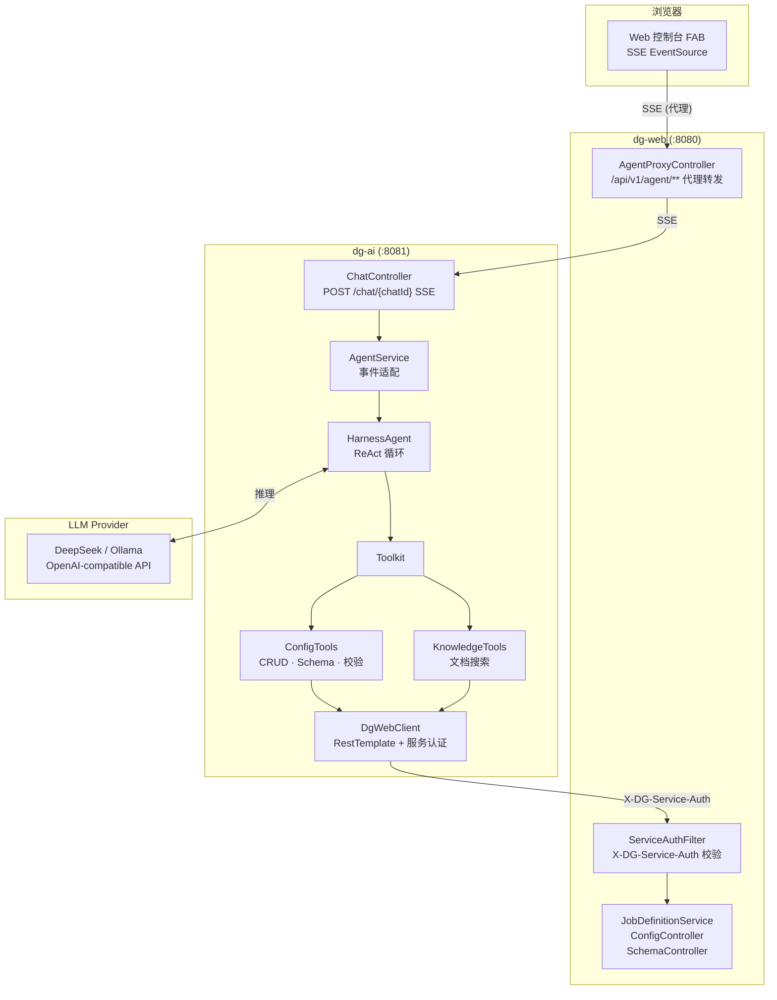
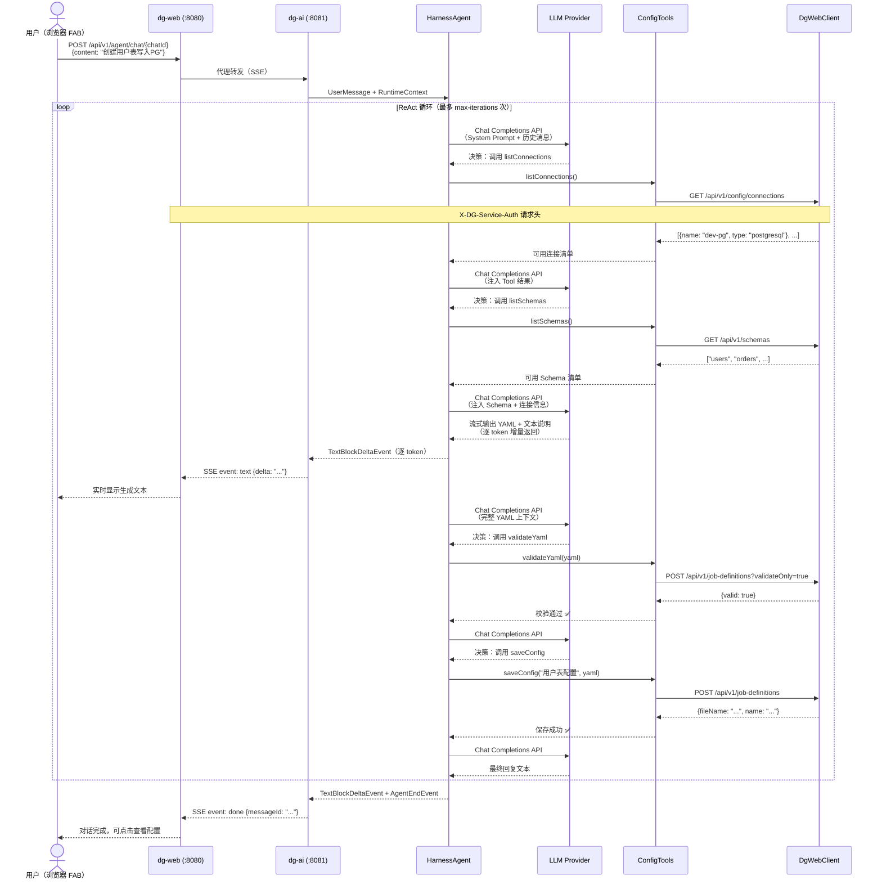

# dg-ai — Data Generator AI Agent 服务

基于 **AgentScope HarnessAgent** 的独立 HTTP 服务，提供多轮对话式 Job 配置生成能力。通过 SSE 与 Web 控制台交互，并借助 Tool Set 回调 dg-web 的 REST API 实现环境探查、配置校验与持久化。

**技术栈：** Java 21 · Spring Boot 3.3 · AgentScope HarnessAgent · Reactor SSE · RestTemplate（HTTP 客户端）

## AgentScope HarnessAgent 框架特性

dg-ai 采用 **AgentScope HarnessAgent** 作为 Agent 运行时，提供了开箱即用的生产级 Agent 能力：

### 核心机制

| 特性 | 说明 |
|---|---|
| **ReAct 循环** | 内置 Reasoning + Acting 循环引擎，Agent 自主决策何时调用 Tool、何时返回最终结果，无需手动编写状态机 |
| **流式事件模型** | 所有 Agent 行为通过强类型 `AgentEvent` 实时推送（文本增量、Tool 调用开始/结束、思考过程、结果返回），前端可按需订阅不同事件类型 |
| **会话状态持久化** | 可插拔 `AgentStateStore`（内存/文件），Agent 对话历史与运行状态自动保存，支持跨请求连续对话 |
| **Toolkit 自动注册** | 基于 `@Tool` 注解自动发现、注册工具方法，无需手动构建 ToolSpec；工具调用结果自动注入后续 ReAct 推理 |
| **Workspace 隔离** | 每个 Agent 实例拥有独立工作目录，支持文件读写类 Tool 的安全沙箱 |
| **迭代上限保护** | `max-iterations` 配置硬限制单次 ReAct 循环次数，防止 LLM 陷入无限工具调用循环 |
| **多 Provider 支持** | 内建 OpenAI-compatible 协议适配，支持 DeepSeek、Ollama、OpenAI 等任意兼容 API |

### HarnessAgent 优势

| 维度 | AgentScope HarnessAgent | 自行编排 |
|---|---|---|
| ReAct 循环 | 内建，开箱即用 | 需手动实现 think→act→observe 状态机 |
| 流式输出 | 强类型事件模型，token 级增量 | 需自行实现 SSE 拼装与事件分发 |
| Tool 注册 | `@Tool` 注解自动发现 | 需手动构建 Tool 定义与参数绑定 |
| 状态管理 | 可插拔持久化（内存/文件） | 需自建会话存储与恢复机制 |
| 迭代保护 | 框架级硬限制 `max-iterations` | 需手动添加计数器与终止逻辑 |
| 异常处理 | 事件级异常传播 + 优雅降级 | 需自行处理各级异常边界 |

### 装配方式

所有 Agent 组件通过 Spring Boot AutoConfiguration 装配，参见 `AiAutoConfiguration.java`：

```java
@Bean
HarnessAgent harnessAgent(Model model, Toolkit toolkit,
        AgentStateStore stateStore, AiProperties props) {
    return HarnessAgent.builder()
            .name(agent.name())                 // Agent 显示名称
            .sysPrompt(SystemPrompt.CONTENT)     // 统一 System Prompt
            .model(model)                       // LLM 模型（OpenAI-compatible）
            .toolkit(toolkit)                   // Tool Set（ConfigTools + KnowledgeTools）
            .stateStore(stateStore)             // 会话状态存储（file / memory）
            .workspace(Paths.get(workspace.root()))  // 工作空间目录
            .maxIters(agent.maxIterations())    // ReAct 最大迭代次数
            .build();
}
```

## 架构概览



## 调用流程图

一次完整的 Job 创建对话从用户输入到配置保存的完整路径：



**流程关键点：**

1. **LLM 自主决策** — 每一步（查询连接、查询 Schema、输出 YAML、校验、保存）均由 LLM 根据 System Prompt 和上下文自主决定
2. **Tool 透明回调** — dg-ai 的 Tool 实现不感知 dg-web 的认证机制，`DgWebClient` 统一注入 `X-DG-Service-Auth`
3. **流式增量输出** — LLM 输出 YAML 时逐 token 推送 SSE，前端实时渲染；Tool 调用事件独立推送，前端可显示调用状态
4. **校验前置** — YAML 必须经 `validateYaml` 校验通过后才调用 `saveConfig`，避免无效配置落库
5. **迭代保护** — 单次对话最多 `max-iterations` 次 LLM 调用，超限后 `ExceedMaxItersEvent` 终止循环并返回错误

## 模块结构

```
dg-ai/
├── pom.xml
└── src/main/java/com/datagenerator/ai/
    ├── AiApplication.java              # Spring Boot 启动入口
    ├── config/
    │   ├── AiAutoConfiguration.java    # HarnessAgent、Model、Toolkit、StateStore 装配
    │   └── AiProperties.java           # @ConfigurationProperties(prefix = "ai")
    ├── controller/
    │   └── ChatController.java         # POST /api/v1/agent/chat/{chatId} (SSE)
    ├── service/
    │   └── AgentService.java           # HarnessAgent streamEvents → SSE 事件适配
    ├── tool/
    │   ├── ConfigTools.java            # 配置 CRUD、Schema/Connection 查询、校验保存
    │   └── KnowledgeTools.java         # 配置文档按需检索（searchDocs / getDocSection）
    ├── client/
    │   └── DgWebClient.java            # dg-web REST 客户端（RestTemplate + 服务认证头）
    ├── prompt/
    │   └── SystemPrompt.java           # 统一 System Prompt（领域知识 + 行为规范）
    ├── dto/
    │   ├── ChatRequest.java            # 对话请求（content + mode）
    │   ├── ApiResponse.java            # 统一响应封装
    │   └── ProviderInfo.java           # LLM Provider 信息
    └── exception/
        └── AiExceptionHandler.java     # 全局异常处理（@RestControllerAdvice）
```

## SSE 事件流

AgentService 将 HarnessAgent 的强类型 `AgentEvent` 转换为 SSE 事件，支持两种输出模式：

| 模式 | 事件类型 | 用途 |
|---|---|---|
| `token`（默认） | `text`、`tool_start`、`tool_end`、`done`、`error` | 前端生产模式 |
| `verbose` | 以上全部 + `thinking`、`observation`、`log` | 调试/排查 |

### 事件映射关系

| AgentEvent（框架层） | SSE 事件 | 模式 |
|---|---|---|
| `TextBlockDeltaEvent` | `text {"delta":"..."}` | 全部 |
| `TextBlockEndEvent` | `text {"end":true}` | 全部 |
| `ThinkingBlockDeltaEvent` | `thinking {"delta":"..."}` | verbose |
| `ThinkingBlockEndEvent` | `thinking {"end":true}` | verbose |
| `ToolCallStartEvent` | `tool_start {"tool":"...","toolCallId":"..."}` | 全部 |
| `ToolCallEndEvent` | `tool_end {"toolCallId":"..."}` | 全部 |
| `ToolResultTextDeltaEvent` | `observation {"delta":"..."}` | verbose |
| `ToolResultEndEvent` | `observation {"end":true}` | verbose |
| `ExceedMaxItersEvent` | `error {"message":"超过最大迭代次数"}` | 全部 |
| `AgentEndEvent` | `done {"messageId":"..."}` | 全部 |

## 快速开始

### 前置条件

- JDK 21+
- Maven 3.8+
- 已启动的 dg-web 实例（可选，用于 Tool 回调）

### 构建与启动

```bash
# 构建（-am 自动构建依赖模块）
mvn clean package -pl dg-ai -am -DskipTests

# 启动（默认端口 8081）
java -jar dg-ai/target/dg-ai-0.1.0-SNAPSHOT.jar
```

### 部署打包

部署 zip 包内包含 dg-ai 的 jar 与独立启停脚本：

```
data-generator-<version>/
├── bin/linux/
│   ├── start-ai.sh / stop-ai.sh / status-ai.sh   # dg-ai 独立启停
│   └── start-all.sh / stop-all.sh                # Web + AI 同时启停
├── bin/windows/                                   # 同上（.bat）
├── lib/
│   └── dg-ai-0.1.0-SNAPSHOT.jar
├── conf/dg-ai/
│   └── application-local.yml.example             # LLM 密钥配置模板
└── logs/
    └── ai-console.log                             # dg-ai 控制台日志
```

```bash
# Linux — 使用部署脚本
./bin/linux/start-ai.sh       # 仅启动 dg-ai
./bin/linux/start-all.sh      # 同时启动 Web + AI

# Windows
bin\windows\start-ai.bat
bin\windows\start-all.bat
```

**端口**：AI 默认 `8081`（环境变量 `AI_SERVER_PORT` 或 `conf/dg-ai/application-local.yml`）。

## 配置说明

### application.yml 主要配置项

```yaml
server:
  port: ${AI_SERVER_PORT:8081}           # 监听端口

ai:
  enabled: true                          # 是否启用 Agent 服务

  model:                                 # LLM 模型配置
    provider: openai-compatible          # 模型 Provider（openai-compatible / ollama）
    base-url: ${AI_MODEL_BASE_URL:http://localhost:11434/v1}
    api-key: ${AI_MODEL_API_KEY:ollama}  # 支持环境变量
    model-name: ${AI_MODEL_NAME:qwen2.5:7b}
    temperature: 0.3
    max-tokens: 4096
    timeout: 120s

  agent:                                 # Agent 行为配置
    name: "Data Generator 配置顾问"       # Agent 显示名称
    max-iterations: 30                   # ReAct 最大迭代次数

  session:                               # 会话状态存储
    store: file                          # file / memory
    file:
      path: ./data/agent-sessions        # 文件存储路径
    ttl: 24h                             # 会话过期时间

  workspace:                             # Agent 工作空间
    root: ./data/agent-workspaces

  dg-web:                                # dg-web 回调配置
    base-url: ${DG_WEB_URL:http://localhost:8080}   # dg-web 地址
    auth-token: ${DG_SERVICE_AUTH:}                 # 服务间认证 token
```

### 本地密钥配置

将 `src/main/resources/application-local.yml.example` 复制为 `application-local.yml` 并填入真实密钥：

```bash
cp application-local.yml.example application-local.yml
```

配置示例（DeepSeek）：

```yaml
ai:
  model:
    provider: openai-compatible
    base-url: https://api.deepseek.com/v1
    api-key: sk-your-key-here
    model-name: deepseek-reasoner
```

也可通过环境变量配置，无需创建 local 文件：

```bash
export AI_MODEL_BASE_URL=https://api.deepseek.com/v1
export AI_MODEL_API_KEY=sk-your-key-here
export AI_MODEL_NAME=deepseek-reasoner
```

## REST API

所有接口前缀为 `/api/v1/agent`。

### 打开对话

```bash
curl -X POST http://localhost:8081/api/v1/agent/chat/open
```

```json
{ "data": { "chatId": "a1b2c3d4-..." } }
```

### 发送消息（SSE 流式响应）

```bash
curl -X POST http://localhost:8081/api/v1/agent/chat/{chatId}?mode=token \
  -H "Content-Type: application/json" \
  -d '{"content": "帮我创建一个用户表，写入 PostgreSQL dev-pg"}'
```

**mode 参数：**

| 值 | 说明 |
|---|---|
| `token`（默认） | 输出 text、tool_start、tool_end、done、error |
| `verbose` | 额外输出 thinking、observation、log（调试用） |

## Tool Set

HarnessAgent 在 ReAct 循环中按需调用以下 Tool。

### ConfigTools — 配置管理工具

| Tool | 说明 |
|---|---|
| `listConfigs` | 列出所有已有 Job 配置 |
| `getConfig(fileName)` | 查看指定配置的完整 YAML |
| `loadConfigForEdit(fileName)` | 加载已有配置用于编辑 |
| `deleteConfig(fileName)` | 删除指定配置（需用户确认） |
| `listConnections` | 查询所有可用数据库连接（名称 + 类型） |
| `listSchemas` | 查询所有可用 Schema 定义（含字段详情） |
| `getSchema(name)` | 查看某个 Schema 的字段详情 |
| `validateYaml(yaml)` | 校验 YAML 语法和业务规则 |
| `saveConfig(configName, yaml)` | 校验通过后保存配置到 dg-web |

### KnowledgeTools — 知识检索工具

| Tool | 说明 |
|---|---|
| `searchDocs(query)` | 按关键词搜索 Data Generator 配置文档，返回相关章节全文 |
| `getDocSection(title)` | 获取配置文档指定章节完整内容 |

**降级策略：** 当 `ai.dg-web.base-url` 未配置时，Tool 调用返回离线提示而非报错，Agent 可在独立模式下运行（只是无法访问 dg-web 数据）。

## Agent 工作流程

Agent 按 System Prompt 中定义的流程执行，LLM 在 ReAct 循环中自主决策每一步：

1. **环境探查** — 调用 `listConnections` / `listSchemas` 了解可用资源
2. **表结构设计** — 确定表名、字段、类型、生成策略、主键、依赖关系
3. **Writer 配置** — 确定目标数据源、写入模式（单写 `writer` / 多写 `writers`）
4. **约束规则** — 根据需要添加校验规则（range、foreign_key、nullable、conditional 等）
5. **Seed 配置** — 如有外部数据依赖则添加
6. **组装保存** — 拼装完整 YAML → `validateYaml` 校验 → `saveConfig` 保存

简单查询（列出配置、查看连接）直接执行，不经过多步流程。

## 与 dg-web 集成

### dg-web 侧配置

```yaml
data-generator:
  ai:
    enabled: true
    remote-base-url: http://localhost:8081   # 指向 dg-ai
    request-timeout: 120s
  service-auth:
    token: ai-tokens                         # 与 dg-ai 的 ai.dg-web.auth-token 一致
```

### 代理转发

dg-web 的 `AgentProxyController` 将 `/api/v1/agent/**` 请求转发至 dg-ai，浏览器只需与 dg-web 通信：

```
浏览器 ──→ dg-web (:8080) /api/v1/agent/chat/{id} ──→ dg-ai (:8081) /api/v1/agent/chat/{id}
```

### 服务间认证

dg-ai 回调 dg-web REST API 时自动携带 `X-DG-Service-Auth` 请求头，由 dg-web 的 `ServiceAuthFilter` 校验，绕过表单登录。

## 独立模式

未配置 `ai.dg-web.base-url` 时，DgWebClient Bean 不会被创建（`@ConditionalOnProperty`）。此时：

- Agent 仍可启动和对话
- Tool 调用（如 `listConfigs`、`validateYaml`）会返回离线提示
- 适合本地调试 LLM 配置和 System Prompt，无需依赖 dg-web

## 运行测试

```bash
mvn clean test -pl dg-ai
```

## 许可证

本项目已开源（版本 `0.1.0-SNAPSHOT`）。
