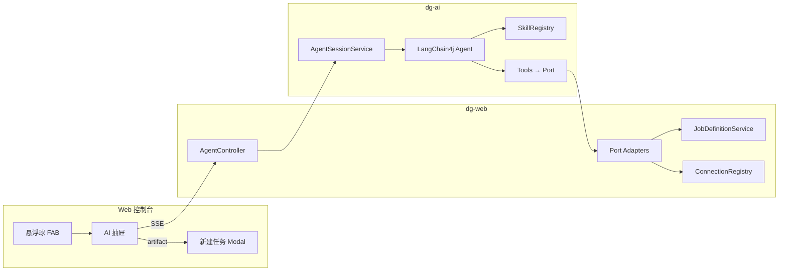
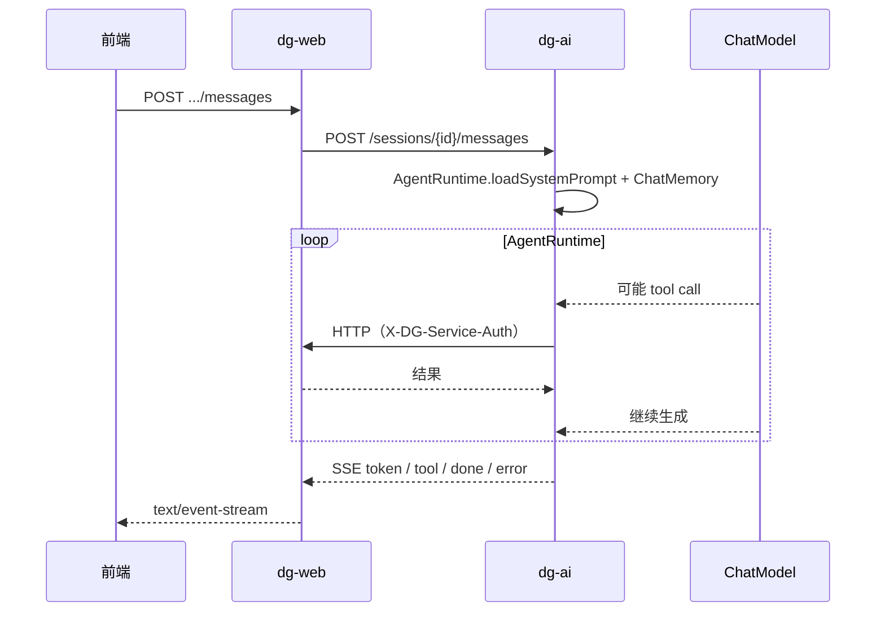

# AI Agent Job 生成设计规格

**日期：** 2026-06-22  
**状态：** 已实现（独立 HTTP 部署）  
**版本：** 1.2

> **架构演进（2026-06-30）：** 本文档为原始设计规格。经过多轮重构后，实际实现已大幅简化：
> - 消除了独立的 Tool 抽象层（Provider/Registry/Interceptor/Factory），Tool 创建归 `AgentRuntime` 自管理
> - `SseEvent` 合并事件工厂，完全通用化；`SseEventFactory` 已删除
> - 配置移除 `default-provider` 和 `tool-set-id`，`ChatModelFactory` 合并入 `AiProperties`
> - `PromptProvider` / `PromptTemplateLoader` 合并为 `AgentPrompt`，动态扫描目录下所有 `.md` 文件
> - `StreamingHandleRegistry` 已删除，cancel 逻辑并入 `AgentSession`
> - `DraftResultProcessor` + `JobArtifactSummaryFormatter` → `JobResultProcessor`
> - 新增 Agent 仅需实现 `AgentRuntime` + `@Component` + 配置 `provider`，`AiAutoConfiguration` 零改动
> - Job CRUD 完整：`saveDraftJobDefinition`（新建）/ `updateDraftJobDefinition`（编辑）/ `deleteJobDefinition`（删除）
> - 当前包结构与 API 见 [`dg-ai/README.md`](../../dg-ai/README.md)
>
> **实现说明（2026-06）：** 首版即采用 **`dg-ai` 独立进程 + HTTP**（默认端口 8081），`dg-web` 通过 `AgentProxyController` 转发 `/api/v1/agent/**`，**无 Maven 依赖**。dg-ai Tool 经 `X-DG-Service-Auth` 回调 dg-web 既有 REST API。打包脚本 `package.ps1` 同时产出两个 jar；启停脚本支持 `start-all` / `start-ai`。

## 1. 概述

### 1.1 目标

为 Data Generator Web 控制台引入 **AI Agent 能力**：用户通过 **悬浮球** 进入对话面板，选择 **Skill**（首版 `generate-job`），以 **多轮对话** 方式生成 Job YAML，校验通过后自动 **打开「新建任务」模态框并填入 YAML**，最终仍由用户核对并通过现有 Job CRUD API 保存。

### 1.2 背景

当前实现：

- Web 控制台（`index.html` + `app.js`）支持 Job 定义 CRUD，YAML 需手工编写
- Cursor Skill `.cursor/skills/generate-job/` 已定义多轮确认流程（writer、seeds、区划、enum 等），禁止臆造连接与地区信息
- 后端无 LLM / Agent 相关代码
- `application.yml` 仅有连接、认证、存储等配置

### 1.3 已确认决策

| 决策项 | 选择 |
|--------|------|
| Agent 框架 | **LangChain4j**（Java） |
| 模块划分 | 新增 **`dg-ai`** 模块；**`dg-web` 只负责调用**（REST/SSE 代理 + Port 适配器） |
| 交互模式 | **多轮对话**，行为对齐 `generate-job` Skill（一轮一问，禁止臆造） |
| LLM | **多 Provider 可切换**（`application.yml` 配置，会话级绑定 provider） |
| Agent 工具 | 经 Port 回调 dg-web：`listConnections`、`listJobDefinitions`、`getJobYaml`、`validateJobYaml` / `validateDraftJobYaml`；可选 `createJobDefinition` / `saveDraftJobDefinition` |
| 保存 Job | 默认由用户在前端核对后保存；Agent 亦可通过 Tool 调用 `POST /api/v1/job-definitions` |
| 部署形态 | **`dg-ai` 独立 HTTP 服务**（默认 8081）；`dg-web` HTTP 代理 + `data-generator.service-auth.token` 服务间认证 |
| 前端入口 | **右下角悬浮球（FAB）** → **右侧抽屉** 对话面板 |
| Artifact 交付 | 校验通过后 SSE `artifact` 事件；前端 **自动打开「新建任务」并写入 YAML** |

### 1.4 非目标（P1）

- 对话内一键保存 Job（`saveJobDefinition` Tool）
- 向量 RAG / 向量库
- 未登录公开 Agent API
- `readTableSchema`、JDBC 读表结构 Tool
- `ai-standalone` 完整 remote 链路（P1 仅骨架 + 文档）
- 配置指南页（`docs.html`）悬浮球（首版仅 `index.html`）
- E2E 依赖真实 LLM 的自动化测试

---

## 2. 架构

### 2.1 方案选择

采用 **方案 1：瘦 Web + 胖 AI**。

| 方案 | 说明 | 结论 |
|------|------|------|
| 1. 瘦 Web + 胖 AI | `dg-ai` 含 LangChain4j、Skill、会话、Tool；`dg-web` 实现 Port 适配器 | **选用** |
| 2. Web 编排 + AI 仅 LLM | Agent 逻辑留在 `dg-web` | 不利于模块抽出 |
| 3. 首日 HTTP 抽象 | 同 JVM 也走 HTTP | P1 复杂度过高 |

### 2.2 模块结构

```
data-generator/
├── dg-spi              # 不变
├── dg-core             # 小扩展：YamlConfigLoader.loadJobFromContent
├── dg-ai               # 新增：AI Agent 引擎
├── dg-plugins/...
└── dg-web              # HTTP 代理 /api/v1/agent；无 dg-ai Maven 依赖
```

**`dg-ai` 包结构**（详见 [`dg-ai/README.md`](../../dg-ai/README.md)）：

```
dg-ai/src/main/java/com/datagenerator/ai/
├── AiApplication.java                    # Spring Boot 启动入口
├── agent/{factory,instances,result,runtime}/   # AgentRuntime 接口 + JobResultProcessor + 实现
├── application/{session,sse,workflow}/         # 用例编排 + SseEvent + 流式管道
├── config/                                     # AiProperties（含模型创建）+ AiAutoConfiguration（仅通用 Bean）
├── exception/                                  # AiExceptionHandler
├── memory/                                     # ChatMemoryStore + InMemoryChatMemoryStore
├── prompt/                                     # AgentPrompt（动态扫描 .md 文件）
├── tool/{model,web}/                           # JobGeneratorTools + DgWebModels + DataGeneratorWebClient
├── util/                                       # JobYamlRootEditor + ResponseFinishReasons
└── web/dto/{common,request,response}/          # AgentController + AgentSseSupport + DTO
```

### 2.3 Port 接口（模块解耦关键）

`dg-ai` 只声明 Port，**实现放在 `dg-web`**：

```java
public interface ConnectionCatalogPort {
    List<ConnectionInfo> listConnections();  // 仅 name + type
}
public interface JobCatalogPort {
    List<JobSummary> listJobs();             // id, name, fileName
}
public interface JobValidationPort {
    ValidationResult validateYaml(String yaml);
}
```

LangChain4j `@Tool` 在 `dg-ai` 内注册，内部调用上述 Port。将来 `dg-ai` 独立部署时，Port 可改为 HTTP Client 调 `dg-web` 内部只读 API。

### 2.4 依赖方向

```
dg-web → dg-ai → dg-core（校验 YAML）
dg-ai ↛ dg-web
dg-core ↛ dg-ai
```

### 2.5 调用关系



### 2.6 部署模式

`dg-ai` 始终作为独立 HTTP 服务运行（默认端口 8081），不存在嵌入/远程双模式。`dg-web` 通过 `AgentProxyController` 将 `/api/v1/agent/**` 转发至 `dg-ai`，两者通过 `X-DG-Service-Auth` 进行服务间认证。

---

## 3. API 与会话

> **与当前实现一致的部分**见 [`dg-ai/README.md`](../../../dg-ai/README.md)。以下为原始设计要点；**以代码与 dg-ai README 为准**的差异：`POST /sessions` 使用 **`agentId`（必填）** 而非客户端自选 `skillId`；`GET /sessions/{id}` 返回草稿快照而非消息历史；SSE 事件名为 `tool` / `validation_error` / `job_saved` 等（非 `tool_start` / `artifact`）。

### 3.1 端点（`dg-web` 暴露，`/api/v1/agent`）

所有接口走现有 Session 登录鉴权。

| 方法 | 路径 | 说明 |
|------|------|------|
| `GET` | `/agents` | 已注册 Agent（仅返回 agentId） |
| `GET` | `/providers` | 已配置 LLM Provider |
| `POST` | `/sessions` | 创建会话（**agentId 必填**，provider 可选） |
| `GET` | `/sessions/{sessionId}` | 会话快照 |
| `DELETE` | `/sessions/{sessionId}` | 结束会话并清除对话记忆 |
| `POST` | `/sessions/{sessionId}/messages` | 发送用户消息；**响应 SSE 流** |

### 3.2 创建会话

```json
POST /api/v1/agent/sessions
{
  "agentId": "job-generator",
  "provider": "deepseek"
}
→ 201
{
  "sessionId": "uuid",
  "agentId": "job-generator",
  "provider": "deepseek",
  "createdAt": "..."
}
```

`provider` 可选；缺省使用 Agent 配置的 provider（`ai.agents.<id>.provider`）。`skillId` / `toolSetId` 由 `ai.agents.<agentId>` 在服务端解析，会话创建后 **不可切换 agent / skill / provider**。

### 3.3 发送消息（SSE）

```json
POST /api/v1/agent/sessions/{sessionId}/messages
{ "content": "我要造一张订单表，写入 dev-safety" }
Accept: text/event-stream
```

| event | data | 用途 |
|-------|------|------|
| `token` | `{"delta":"..."}` | 流式文本 |
| `tool` | `{"name":"...","status":"done"}` | Tool 调用完成 |
| `job_saved` | `{"status":"ok"}` | 草稿已通过 Tool 写入控制台 |
| `validation_error` | `{"errors":[...]}` | YAML 语义校验失败 |
| `done` | `{"messageId","draftIncomplete","draftValidated","hasDraft"}` | 本轮结束 |
| `error` | `{"code","message"}` | 错误 |

### 3.4 Skill 列表

```json
GET /api/v1/agent/skills
→ [
  {
    "id": "generate-job",
    "name": "生成 Job 配置",
    "description": "多轮确认 writer、seeds、区划等，输出 YAML"
  }
]
```

Skill 元数据来自 `classpath:skills/*/SKILL.md` 的 YAML front matter（`name`、`description`）。

### 3.5 会话模型

| 字段 | 说明 |
|------|------|
| `sessionId` | UUID |
| `agentId` | 绑定的 Agent（创建时指定） |
| `toolSetId` | 由 Agent 配置解析（内部使用，API 快照可选返回） |
| `provider` | 本会话 LLM provider |
| `ChatMemory` | 进程内多轮对话历史（按 sessionId） |
| `job.draft.yaml`（上下文键） | 会话草稿 YAML（由最终收敛结果提取） |
| `job.draft.validated` / `job.draft.incomplete`（上下文键） | 草稿校验状态 |
| `createdAt` / `lastActiveAt` | TTL 清理依据 |

**P1 存储：进程内 + TTL**

- `ConcurrentHashMap` + 定时清理
- 配置：`data-generator.ai.session.ttl`（默认 2h）、`max-sessions`（默认 100）
- **不写入 SQLite**（Agent 会话为 ephemeral）
- 将来可增 `SessionStore` 接口换 Redis/SQLite，不改 API

**remote 模式注意：** 会话落在 AI 进程，需单实例或会话粘滞（P2 文档化）。

### 3.6 配置示例

```yaml
ai:
  enabled: true
  server: true
  agents:
    job-generator:
      provider: deepseek
  providers:
    deepseek:
      type: open-ai-compatible
      base-url: https://api.deepseek.com/v1
      api-key: ${DEEPSEEK_API_KEY:}
      model: deepseek-chat
```

`enabled: false` 时 `/api/v1/agent/*` 返回 503，前端隐藏悬浮球。

---

## 4. Agent 与 Tool

### 4.1 技术选型

| 组件 | 选型 |
|------|------|
| Agent 模式 | LangChain4j **AiServices + @Tool** |
| 记忆 | `MessageWindowChatMemory`（上限可配，默认 40 条） |
| 流式 | `StreamingChatModel` + `TokenStream` → SSE `token` |
| Provider 创建 | `AiProperties` 根据 `type` 创建对应 `StreamingChatModel` |

### 4.2 AgentRuntime 接口

Agent 核心接口，包含 6 个方法：

- `getAgentId()` — 返回 Agent 标识
- `getSystemPrompt()` — 系统提示词
- `createChatMemory()` — 创建会话记忆
- `getTools(Object... toolArgs)` — 创建 Tool 实例
- `onComplete(...)` — 流完成回调，处理草稿结果
- `onToolExecuted(...)` — Tool 执行后回调

### 4.3 JobGeneratorAgentRuntime

`job-generator` Agent 的实现：

- 内部定义 `JobGeneratorAgent` 接口（标注 `@AiService`）
- 通过 `JobGeneratorAgentRuntime` 创建 AiServices 实例
- `getTools()` 返回 `JobGeneratorTools` 实例（`listConnections`、`listJobDefinitions`、`validateJobYaml`）
- `onComplete()` 委托 `DraftResultProcessor` 提取并校验最终 YAML
- Tool 通过 HTTP 回调 dg-web（`DataGeneratorWebClient` 经 `X-DG-Service-Auth` 认证），不再使用 Port 接口

### 4.4 工具（Tool）

工具不再通过独立的 ToolProvider/Registry/Interceptor 层管理，由 `AgentRuntime.createToolExecutors()` 自管理。当前共 16 个 @Tool，完整列表见 [`dg-ai/README.md`](../../dg-ai/README.md)。

核心 CRUD 工具：

| Tool | 入参 | 返回 | 对应 API |
|------|------|------|----------|
| `listJobDefinitions` | 无 | `[{id, name, fileName}]` | `GET /api/v1/job-definitions` |
| `getJobYaml` | `fileName` | YAML 摘要 | `GET /.../{name}` |
| `saveDraftJobDefinition` | `displayName, fileName` | 新建结果 | `POST /api/v1/job-definitions` |
| `updateDraftJobDefinition` | `fileName, displayName` | 更新结果 | `PUT /.../{name}` |
| `deleteJobDefinition` | `fileName` | 确认 | `DELETE /.../{name}` |

### 4.5 YAML 校验路径

`dg-core` 的 `YamlConfigLoader.loadJobFromContent(String)` 用于 YAML 解析校验。`DataGeneratorWebClient` 通过 HTTP 调用 dg-web 的 `POST /api/v1/internal/job-definitions/validate` 间接使用。

### 4.6 单轮执行流程



---

## 5. 前端

### 5.1 悬浮球 + 抽屉

| 元素 | 说明 |
|------|------|
| **FAB** | 右下角固定，`index.html` 任务管理页可见；`aria-label="AI 生成 Job"` |
| **点击** | 展开右侧抽屉（宽 360–420px） |
| **收起** | 关闭抽屉回到 FAB，**不 DELETE 会话**（除非用户「结束对话」） |
| **再次打开** | 未过期则恢复 sessionId 与历史 |

### 5.2 面板流程

1. 选择 Skill（首版仅 `generate-job`）
2. 可选 Provider → `POST /sessions`
3. 多轮聊天（SSE 流式渲染）
4. 收到 `artifact` → **自动** `openNewDefinitionModal()` → 写入 `#definition-content` → Toast「YAML 已填入，请核对后保存」
5. 用户核对 → 现有「保存」→ `POST /api/v1/job-definitions`

### 5.3 文件变更

| 文件 | 变更 |
|------|------|
| `index.html` | FAB、抽屉 DOM |
| `agent.js`（新建） | SSE、会话状态、`onArtifact` |
| `app.js` | 抽出 `openNewDefinitionModal()` 供复用 |
| `style.css` | `.ai-fab`、`.ai-drawer`；小屏抽屉全屏 overlay |

### 5.4 CSRF

SSE `POST` 沿用现有 CSRF token（`csrf.js`）。

---

## 6. `dg-web` 实现清单

| 类 | 职责 |
|----|------|
| `AgentProxyController` | 将 `/api/v1/agent/**` HTTP 代理转发至 dg-ai（非 Maven 依赖） |
| `ServiceAuthFilter` | 校验 `X-DG-Service-Auth` 请求头（服务间调用鉴权） |

---

## 7. 错误处理与安全

### 7.1 错误处理

| 场景 | 响应 |
|------|------|
| AI 未启用 | 503；悬浮球隐藏 |
| Provider / API Key 缺失 | 503（创建会话时） |
| 会话不存在 / 过期 | 404 |
| 超过 max-sessions | 429 |
| LLM 超时 | SSE `error`，会话保留可重试 |
| YAML 校验失败 | 无 `artifact`，Agent 同会话修正 |
| SSE 断开 | abort TokenStream，无副作用 |

### 7.2 安全

| 项 | 策略 |
|----|------|
| 鉴权 | Session 登录，与 Job API 同级 |
| API Key | 仅服务端，不下发前端 |
| 连接信息 | Tool 仅 name + type |
| Prompt 注入 | Skill 约束 + 只读 Tool |
| 日志 | 不记录 API Key；YAML 日志可截断 |

---

## 8. Maven 变更

父 POM `modules` 增加 `dg-ai`。

```xml
<!-- dg-web -->
<dependency>
  <groupId>com.datagenerator</groupId>
  <artifactId>dg-ai</artifactId>
</dependency>
```

**`dg-ai` 依赖：** `dg-core`、LangChain4j、Spring Boot（optional，standalone 用）。

---

## 9. Phase 划分

| Phase | 范围 |
|-------|------|
| **P1（本 spec）** | embedded 全功能、`generate-job`、3 Tool、FAB+抽屉、SSE、多 Provider、artifact 自动开模态 |
| **P2** | `ai-standalone` + remote Client；Port HTTP 回调；会话 Redis/SQLite |
| **P3** | 新 Skill、`readTableSchema` Tool、RAG reference |

---

## 10. 测试策略

| 层级 | 范围 |
|------|------|
| `dg-core` | `loadJobFromContent` 单元测试 |
| `dg-ai` | `SkillRegistry`、`ArtifactExtractor`、Tool+Mock Port |
| `dg-web` | `AgentController` `@WebMvcTest`；Port Adapter 单元测试 |
| 集成 | 真实 LLM：`@Disabled` + 手工验证清单 |

---

## 11. 验收标准（P1）

1. 登录后可见悬浮球；`ai.enabled=false` 时隐藏
2. 选 `generate-job` + provider，多轮对话可经 Tool 列出连接名
3. 完整 YAML 经 `validateJobYaml` 通过后才发 `artifact`
4. 收到 `artifact` 自动打开「新建任务」并填入 YAML
5. 用户保存后 Job 可经现有流程正常运行
6. `mvn clean test` 通过

---

## 12. 参考

- Cursor Skill：`.cursor/skills/generate-job/SKILL.md`
- 配置指南：`dg-web/src/main/resources/static/docs/config-guide.md`
- Job 定义 CRUD：`JobDefinitionController` / `JobDefinitionService`
- 连接注册：`ConnectionRegistry`、`data-generator.connections`
